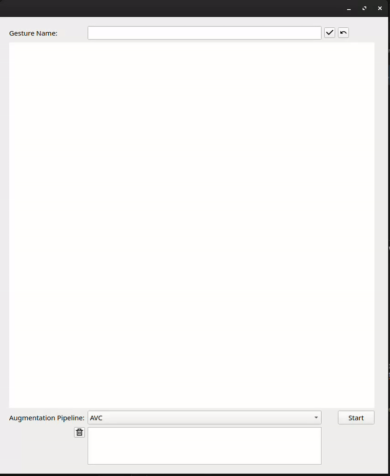

[](https://classroom.github.com/a/Ki47e6IN)
# Usage

Start application with:

```
python3 gesture_application/application.py
```

In this window, you can enter a label of any gesture you want to draw in the canvas below. To confirm your entered gesture, push the button next to the input field of the label. If you want to restart drawing the gesture, push the undo button. To start training the model, push the start button. After training the model, you can draw any gesture in the canvas. The prediction appears above the canvas (with the accuracy score of the prediction). To end the application, close the window with 'x'.


