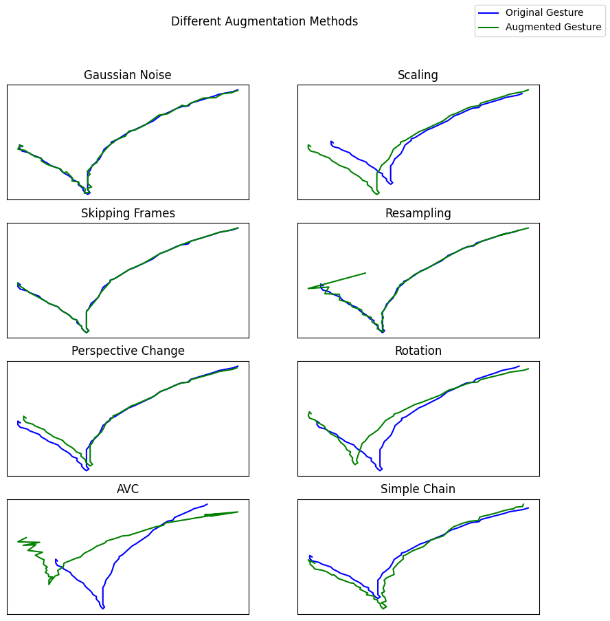

# Documentation

## Gesture Recognition

### Decision Process

After some research, we limited our selection to four papers (Gyory et al., 2023; Iravantchi et al., 2023; Maslych et al., 2023; Wilson, 2006). Two of them (Gyory et al., 2023; Wilson, 2006) thematize interaction techniques based on computer vision. Iravantchi et al. (2023) use digital signal processing and surface acoustic waves to implement an interaction technique. The paper we chose in the end is by Maslych et al.(2023), where they used a machine learning model to recognize gestures. The special and most interesting aspect of this implementation is that they needed only one input trajectory per gesture for training their model. This is a huge advantage in comparison to other machine learning gesture recognizers or the 1$-Recognizer as it does not require such a large dataset. This was implemented by augmenting the input gesture with different methods. The proposed methods were the following:

- Gaussian noise: add noise to the input gesture (with sigma=0.8)
- Scaling: scale the input gesture by a factor between 0.8 and 1.2
- Rotating: rotating the input gesture by an angle between -20° and 20°
- Perspective change: rotating the trajectory around the x and y axes by an angle between -30° and 30° (adding 3rd dimension & multiplying points by the x and y rotation matrices)
- Spatial resampling: generate list of distance intervals & using the list to sample points along the trajectory (with a factor between 5 and 2 \* length of the input trajectory)
- Frame skipping: removal of some points from the trajectory (with a sample chance of 0.3)

### Implementation

The main application (implementation of the GUI with PyQt) is located in application.py.
The augmentation of the dataset is done in augmentation.py. We implemented four augmentation chains:

- Simple chain: rotating, scaling, random Gaussian noise
- Gaussian: random Gaussian noise
- AVC (all variability chain): random Gaussian noise, Skipping frames, spatial resampling, perspective change, rotating and scaling.
- None: No augmentations are performed
  A visualization of the different augmentation methods can be viewed in augmentation_demo.ipynb.



The creation and training of the machine learning model is implemented in model.py. The model in this application differs from the model proposed in Maslych et al.(2023). Reason for this was the lower accuracy score for the RNN in our implementation of the models. A comparison of the two models is described in model_demo.ipynb. We implemented both models with Tensorflow Keras. The training set is pre-padded to the length of the longest trajectory. Both models take raw and unprocessed data input trajectories from the dataset of the 1$-Recognizer (in the notebook; in the main application the entered input trajectories are used). The utilization of the Adam Optimizer with a learning rate of 0.001, a batch size of 512, and the Cross Entropy Loss criterion was kept the same across models. The model that is used in the final application has an LSTM layer with 96 input neurons. Three dense layers with a ReLu activation function or a softmax function follow.

### Usage of the Prototype

Launch the application with:

```
python3 gesture_application/application.py
```

In this window, you can enter a label of any gesture you want to draw in the canvas below. To confirm your entered gesture, push the button next to the input field of the label. If you want to restart drawing the gesture, push the undo button. To start training the model, push the start button. After training the model, you can draw any gesture in the canvas. The prediction appears above the canvas (with the accuracy score of the prediction). To end the application, close the window with 'x'.

### References

Gyory, P., Bae, S. S., Yang, R., Do, E. Y. L., & Zheng, C. (2023, April). Marking Material Interactions with Computer Vision. In Proceedings of the 2023 CHI Conference on Human Factors in Computing Systems (pp. 1-17).

Iravantchi, Y., Zhao, Y., Kin, K., & Sample, A. P. (2023, April). SAWSense: Using Surface Acoustic Waves for Surface-bound Event Recognition. In Proceedings of the 2023 CHI Conference on Human Factors in Computing Systems (pp. 1-18).

Maslych, M., Taranta, E. M., Aldilati, M., & Laviola, J. J. (2023, April). Effective 2D Stroke-based Gesture Augmentation for RNNs. In Proceedings of the 2023 CHI Conference on Human Factors in Computing Systems (pp. 1-13). https://dl.acm.org/doi/10.1145/3544548.3581358

Wilson, A. D. (2006, October). Robust computer vision-based detection of pinching for one and two-handed gesture input. In Proceedings of the 19th annual ACM symposium on User interface software and technology (pp. 255-258).

Vectors and icons by [SVG Repo](https://www.svgrepo.com)
